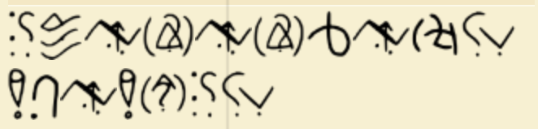

# Batman Protocol 

**Category:** Cryptography  
>Flag Format: `cscuu{}`

---

### Problem Description:

Inspired by the mind of Batman, this puzzle is more than it appears. What’s hidden in the shadows can only be revealed by those who observe like he does—carefully, patiently, and with purpose. Not everything is as it seems.

Click Here to Download the png file: [cipher.png](../Image_Folder/cipher.png)

---

### Approach

I opened the challenge and found an image file named `cipher.png`.  
After downloading and viewing the image, it looked like a grid of strange symbols — many glyphs repeated across the picture. The puzzle text referenced **Batman** and the filename was `cipher.png`, so I suspected the cipher name or clue might be related to Batman.

I searched Google with the keywords "Batman cipher".
And guess what? I found something interesting: RataAlada Cipher.
RataAlada (as found on dCode) is a symbol-to-letter substitution tool used in puzzle/Cypherhunt contexts.

This cipher is sometimes nicknamed the "Batman Cipher" because of its appearance and stylized glyphs.
It was originally designed for use in creative puzzles and thematic games, known for its distinctive symbol set that resembles secret vigilante messages.

**Dcoder Link:** [RataAlada_Cipher_(Batman)](https://www.dcode.fr/rata-alada-cipher) 

---

 **Symbol mapping & decryption**  
 
I opened `cipher.png` and compared each glyph to the glyphs shown on the [RataAlada page.](https://www.dcode.fr/rata-alada-cipher) I entered the symbols into the dCode RataAlada interface in the same order they appeared in the image.After filling the mapping, I clicked **Decrypt**.

**Success!** The tool returned the plaintext immediately. I felt excited — this was the exact flag text revealed.

---

## **Flag:**  ``cscuu{THISISCIBERPIRATE}``
