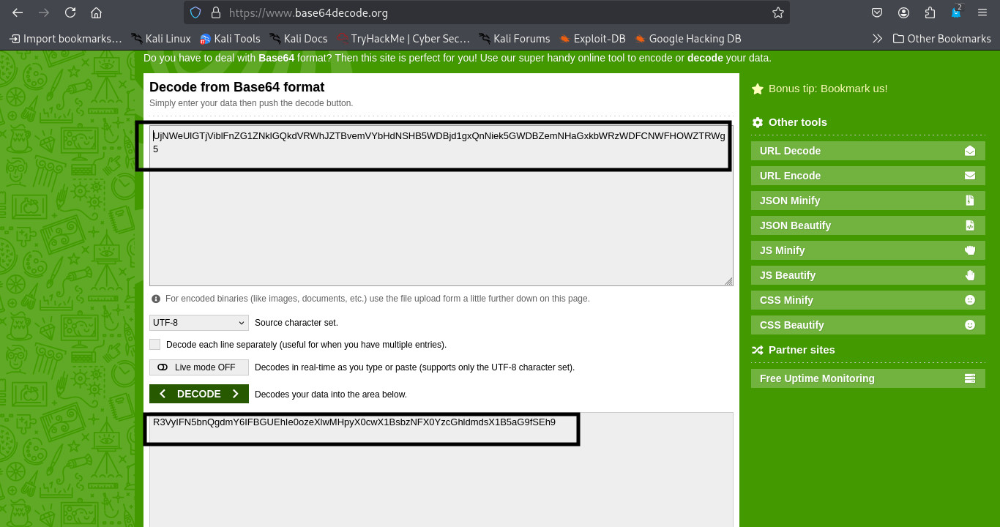
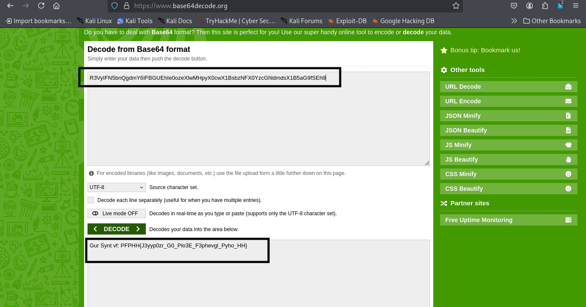
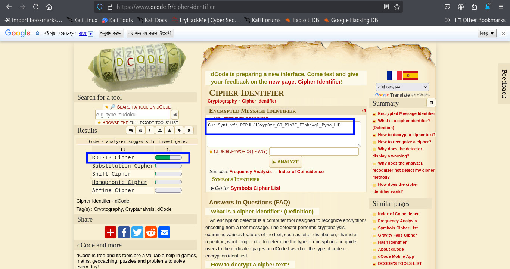
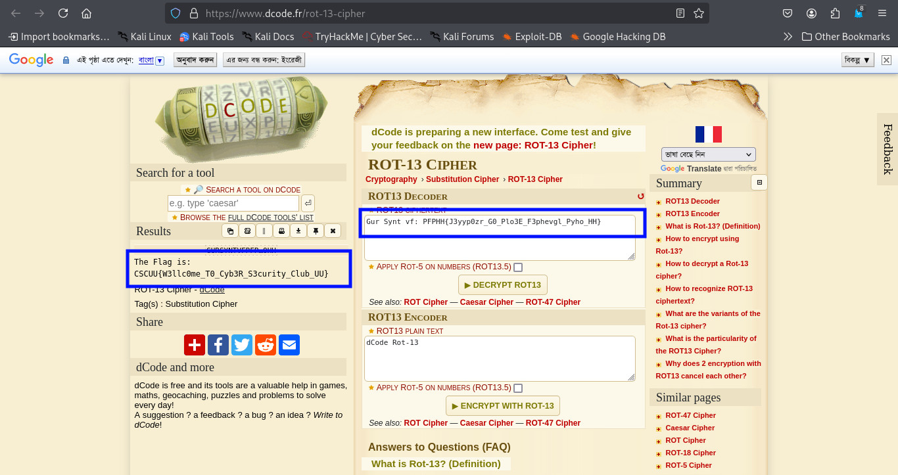

# Cipher Cascade 
> **Category:** Cryptography

**Flag format:** ``CSCUU{some_text}``

## Challenge Description:

Welcome to the Mystery Challenge. Your task is to decode it and determine the next steps.Welcome to the Mystery Challenge. Your task is to decode it and determine the next steps.

**Encrypted Text:** UjNWeUlGTjViblFnZG1ZNklGQkdVRWhJZTBvemVYbHdNSHB5WDBjd1gxQnNiek5GWDBZemNHaGxkbWRzWDFCNWFHOWZTRWg5


---

## Approach:

First, I carefully read the problem.The given Encrypted text looks like a Base64 string because of the character set and padding style. Base64 encoding is a common method to encode binary data into ASCII characters, often used in CTFs to obfuscate data. It’s not an encryption, but encoding. And Base64 decoding is the process of converting data that has been encoded using Base64 back into its original form.
 

I decoded it using [Base64 decoder](https://www.base64decode.org/)



  
**The decoded result was:** ``R3VyIFN5bnQgdmY6IFBGUEhIe0ozeXlwMHpyX0cwX1BsbzNFX0YzcGhldmdsX1B5aG9fSEh9``

This output also looked like Base64, so I decoded it again.



**The second decoded result was:**  ``Gur Synt vf: PFPHH{J3yyp0zr_G0_Plo3E_F3phevgl_Pyho_HH}``

So, Now I got a cipher text which is like as the flag.Now I go to decrypt it.But at first need to verify the cipher type.
Although the question gave a hint, I still verified the cipher type using [dCode Cipher Identifier](https://www.dcode.fr/cipher-identifier).  




It confirmed the cipher is ROT13. 
ROT13 is a simple substitution cipher that replaces each letter with the letter 13 places after it in the alphabet. It is its own inverse, meaning applying ROT13 twice returns the original text.  


So, I applied ROT13 decryption using [ROT13 Decoder](https://www.dcode.fr/rot-13-cipher)



Yay! By decoding layer after layer, we successfully found the flag.

---
### Flag: ```CSCUU{W3llc0me_T0_Cyb3R_S3curity_Club_UU}```

