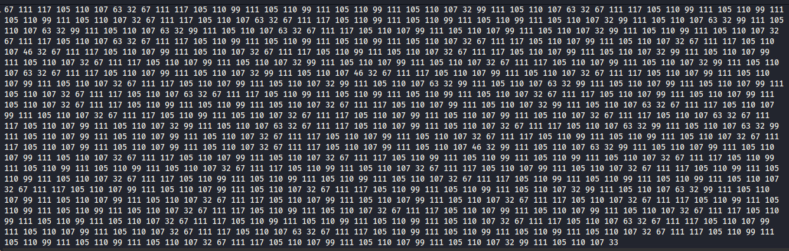
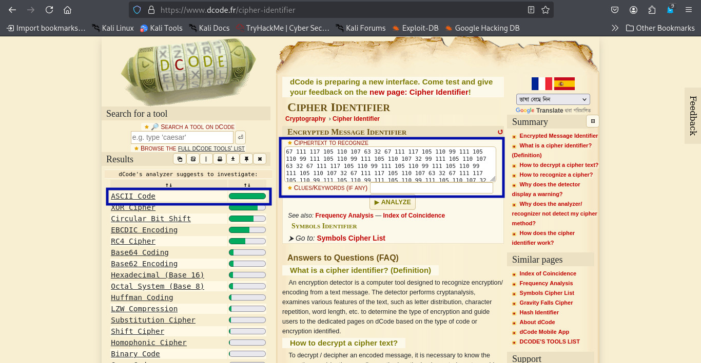
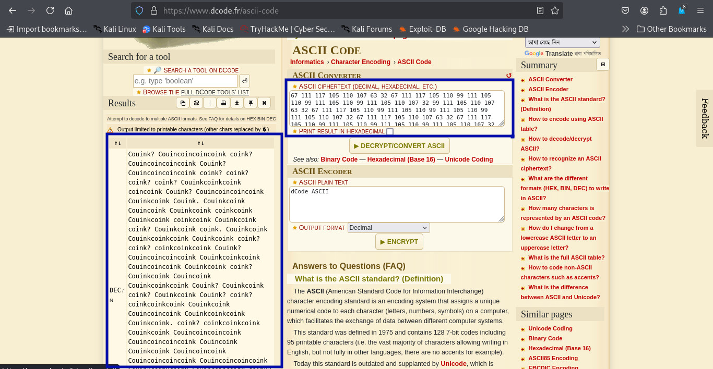
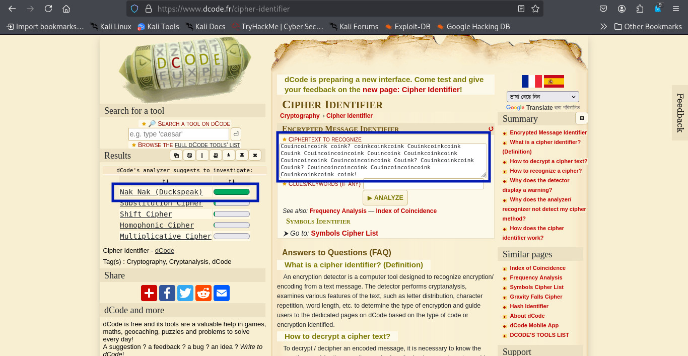
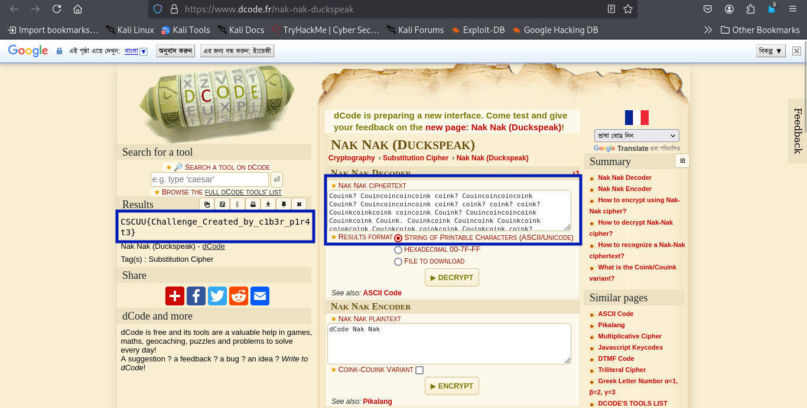

### Duckpond Cipher
>**Category:** Cryptography

**Flag Format:** CSCUU{}

---
### Description:

A strange transmission has surfaced—resembling nothing but a series of peculiar quacks and ripples from the depths of an unknown pond. At first glance, it seems like mere noise, but seasoned solvers know better. Beneath this watery confusion lies a carefully crafted cipher, disguising its true nature. Can you dive through the deception, navigate the duck’s cryptic language, and surface with the hidden flag?

**Download File:** [File](../External_Folder/WeeklyCTF.txt)

---

### Approach:

When I first read the challenge description, nothing obvious jumped out — just a hint about “duck-like” sounds hiding something important. The challenge also provided a downloadable text file.

After downloading it, I opened the file and was greeted by a massive wall of numbers, all separated by spaces. 




My first thought was, “Okay, this could be **ASCII**, but let’s confirm.” So I grabbed the entire sequence and ran it through an online cipher identification tool. The result confirmed my suspicion: these numbers were ASCII codes.

**Using tools:** [Cipher-Identifier](https://www.dcode.fr/cipher-identifier)



I quickly threw them into an ASCII-to-text converter, expecting something clear — but instead I got a weird, repetitive line that looked like some duck-language poetry:
``Couink? Couincoincoincoink coink? ...``

**Using tools:** [ASCII Converter](https://www.dcode.fr/ascii-code)



At this point I knew the flag wasn’t here yet. This had to be another layer of encoding. I copied this odd text back into the cipher identifier, and sure enough, it came up as **Nak Nak (Duckspeak)** — a novelty cipher that replaces characters with duck-like sounds.



With the cipher type confirmed, I dropped the text into a Nak Nak decoder. One click later, the gibberish disappeared and the real flag appeared on my screen.


**Using tools:** [Nak Nak Decoder](https://www.dcode.fr/nak-nak-duckspeak)



**Mission accomplished.**

---

### **Flag**: ```CSCUU{Challenge_Created_by_c1b3r_p1r4t3}```

