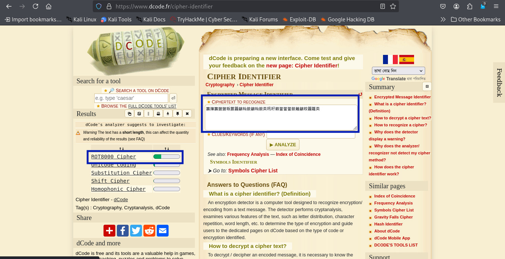
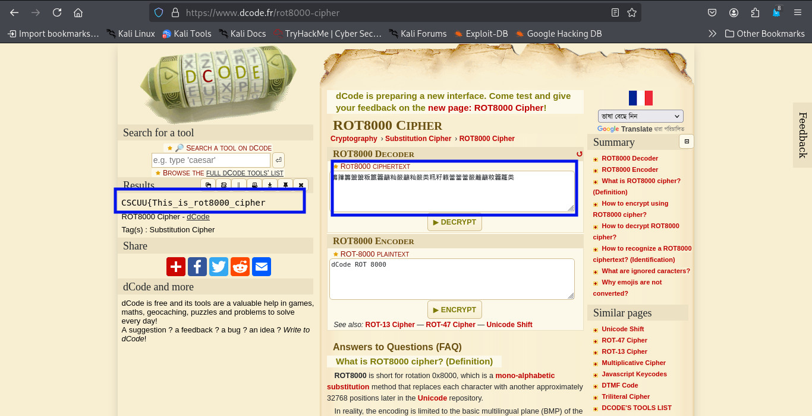

### Lost in Rotation 
>**Category:** Cryptography

**Flag Format:** ``CSCUU{some_text_here}``

---

### Description:

The text of an old book has been found, but it is utterly jumbled! According to scholars, it was encoded using a rotational cipher that was much more complex than the typical ROT13 or even ROT47.

They believe the rotation encompasses a far wider range of characters and isn't just restricted to regular ASCII. Can you figure out what the text's hidden message is?

**Cipher text:籌籜籌籞籞粄籝籱籲籼籨籲籼籨类籸籽籁簹簹簹籨籬籲籹籱籮类**

---

### Approach:

When I first read the challenge description, it mentioned a rotational cipher but hinted that it was far more complex than simple **ROT13** or **ROT47**. That got my attention — especially when I saw the cipher text:


```籌籜籌籞籞粄籝籱籲籼籨籲籼籨类籸籽籁簹簹簹籨籬籲籹籱籮类```

The characters was not clear to me — they looked like extended Unicode symbols, possibly from CJK (Chinese, Japanese, Korean) ranges. My first move was to feed this directly into an online cipher identifier to see what it thought.

**Using tools:** [Cipher-Identifier](https://www.dcode.fr/cipher-identifier)



The analysis came back identifying it as a **ROT8000** cipher.

For context, **ROT8000** is a rotation cipher similar in concept to **ROT13**, but it works over the massive Unicode range (starting around codepoint U+8000), allowing it to shift a huge set of characters, not just the Latin alphabet or common ASCII symbols. It’s often used in challenges to make encoded text look like random Asian characters or symbols.

Armed with that information, I went to a **ROT8000 decoder**, pasted the cipher text in, and hit decrypt. Instantly, the garbled symbols transformed into readable English — and right there was the flag.

**Using tools:** [ROT8000 Decoder](https://www.dcode.fr/rot8000-cipher)




That was it. Super quick, super clean — probably one of the easier challenges of the set once the cipher type was identified.

---

### **Flag:** ```CSCUU{This_is_rot8000_cipher}```


