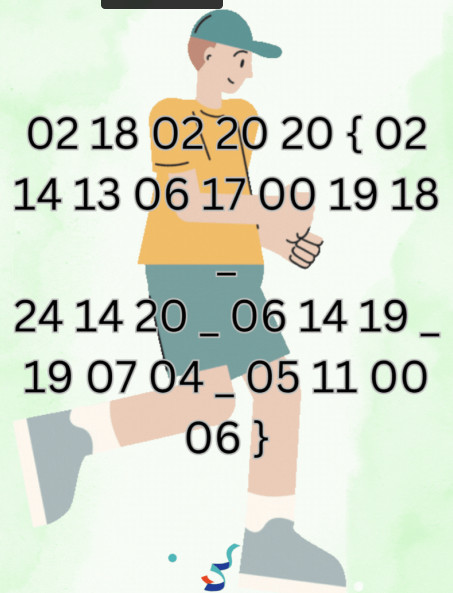
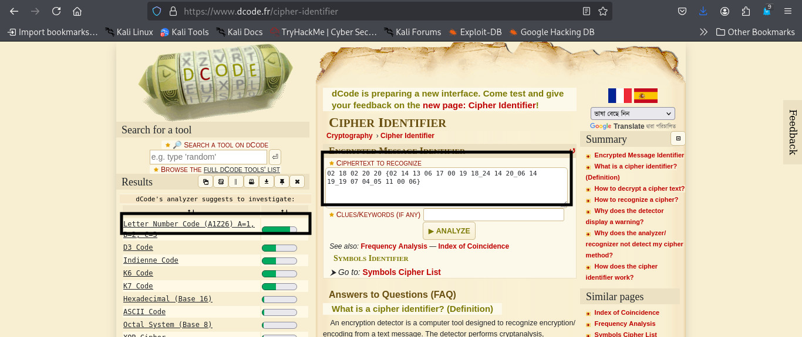
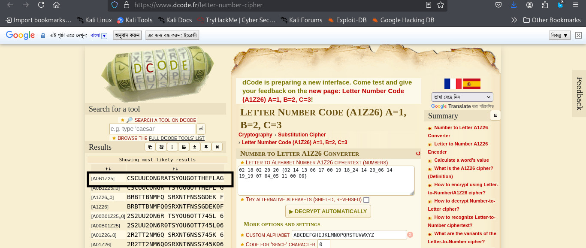

# Numbers Game

>**Category:** Cryptography


**Flag_format:** "CSCUU{}"


---

### Problem Description:
What do the numbers represent?


**Attached File:**  [Download GIF](../External_Folder/decimal_challange.gif)

--- 

### Approach:

I read the challenge and saw an attached file named `decimal_challange.gif`.  
After downloading and opening it, I noticed that the GIF displayed some numbers in sequence.

   


1. **Metadata Analysis**  
   First, I used **ExifTool** to check if the GIF contained any hidden metadata.  
   *ExifTool* is a command-line tool that extracts metadata from files (such as camera info, timestamps, embedded comments, or hidden data).  
   In this case — nothing useful was found.

2. **Frame Extraction**  
   Next, I tried **Gifsicle** to inspect and extract the GIF frames.  
   *Gifsicle* is used to split GIFs into individual frames, optimize them, or modify them frame-by-frame.  
   Again — no extra hidden information was discovered.

3. **Visible String Analysis**  
   Since nothing was hidden in metadata or frames, I focused on the numbers that appeared directly in the GIF:  

   ``02 18 02 20 20 {02 14 13 06 17 00 19 18_24 14 20_06 14 19_19 07 04_05 11 00 06}``


4. **Cipher Identification**  
I used [dCode Cipher Identifier](https://www.dcode.fr/cipher-identifier) to detect the encryption method.  
The tool suggested it was a **Letter-to-Number Cipher**.

   
   

6. **Decryption**  
Using [dCode Letter Number Cipher](https://www.dcode.fr/letter-number-cipher), I decoded the string to:  

   
   

6. **Formatting the Flag**  
Adjusting it to the challenge’s required format :

       CSCUU{CONGRATS_YOU_GOT_THE_FLAG}


---

### Alternative (Simpler) Method — Number Mapping

A quicker approach is direct **Number Mapping** where:  
`00=A, 01=B, 02=C, ... , 25=Z`

**Mapping Table:**


| 00 = A | 01 = B | 02 = C | 03 = D | 04 = E | 05 = F |
|--------|--------|--------|--------|--------|--------|
| 06 = G | 07 = H | 08 = I | 09 = J | 10 = K | 11 = L |
| 12 = M | 13 = N | 14 = O | 15 = P | 16 = Q | 17 = R |
| 18 = S | 19 = T | 20 = U | 21 = V | 22 = W | 23 = X |
| 24 = Y | 25 = Z |        |        |        |        |


Replacing the numbers using this table gives the exact same result.


The challenge could be solved either by identifying the cipher via online tools or by applying direct number mapping.  
Both methods lead to the same final flag.

---

### **Flag:** ```CSCUU{CONGRATS_YOU_GOT_THE_FLAG}```
