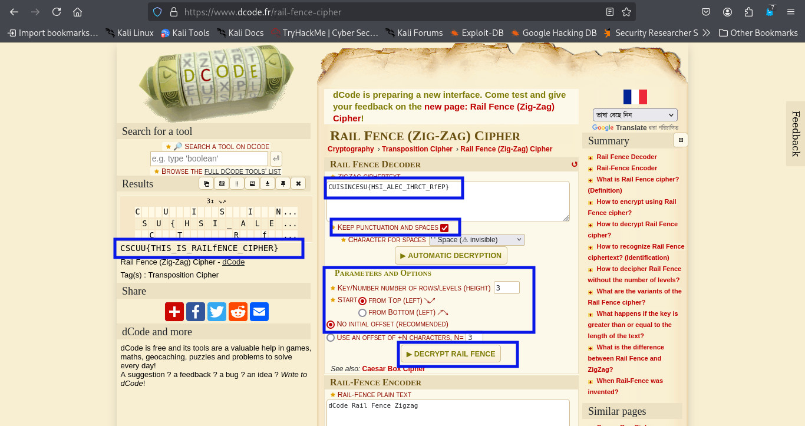

### Rails of Secrets
>**Category:** Cryptography

**Flag Format:** ``CSCUU{}``

---

### Description:

A type of transposition cipher is the rail fence cipher, Here is one such cipher encrypted using the rail fence with 3 rails. Can you decrypt it? 
**cipher text:** CUISINCESU{HSI_ALEC_IHRCT_RfEP}

---

### Approach:


I started by reading the challenge description. It mentioned the **Rail Fence Cipher**, a type of transposition cipher. Unlike substitution ciphers that replace letters, a transposition cipher keeps all the original characters but rearranges their positions according to a specific pattern.

The Rail Fence Cipher works by writing the message in a **zig-zag** pattern across a set number of “rails” (rows), and then reading it row by row. For example, with 3 rails, the text is written diagonally down and up across those rows, creating a scrambled sequence when read straight across.

The given ciphertext was:


```CUISINCESU{HSI_ALEC_IHRCT_RfEP}```

My first step was to head over to an online **Rail Fence Cipher decoder**. I pasted the ciphertext in and ran a quick automatic decode, but the output didn’t look like a valid flag.

That’s when I remembered to check the problem statement again — it clearly mentioned the encryption used **3 rails**. So I went back to the decoder and adjusted the parameters:

    Number of rails/levels (height): 3

    Start from: Top (↘↗ pattern)

    Initial offset: None (default)

With the correct settings in place, I hit Decrypt.


**Using tools:** [Rail Fence Decoder](https://www.dcode.fr/rail-fence-cipher)




And just like that — boom! — the scrambled text rearranged itself into a perfect flag.

This one was all about noticing the specific number of rails mentioned in the challenge — without that, the output stays meaningless.


---

### **Flag** : ```CSCUU{THIS_IS_RAILfENCE_CIPHER}```
