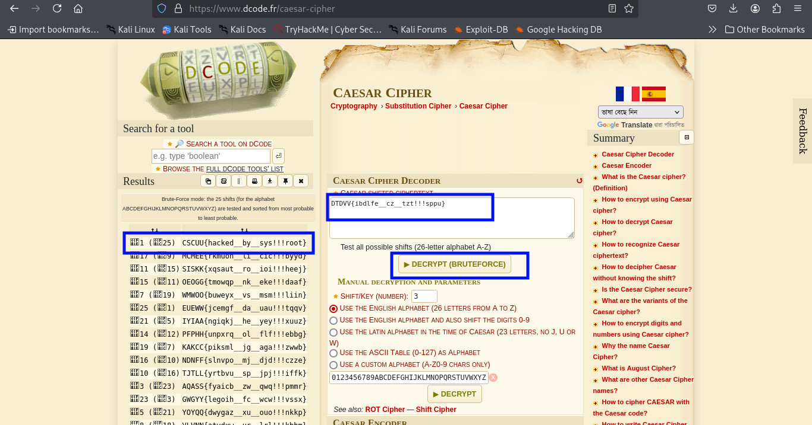

### The Wizards Shift
>**Category:** Cryptography

**Flag Format:** ```CSCUU{SOME_TEXT}```

---

### Description:

In the magical land of Bangladesh, the wise old Wizard Tithi has hidden a secret message in a mystical flag which is

**DTDVV{ibdlfe__cz__tzt!!!sppu}** . To protect the flag, he used two powerful spells: the (23-10) Spell and the Sys_root Spell.

The sys_root Spell is a bit tricky—it moves each letter in the alphabet by a number that’s really far away, something like (-200-5-5-5-5) steps! But don’t worry, the wizard left a clue: you can find out where the letters really end up if you solve this puzzle:

"If I twist time by (-200-5-5-5-5) steps, where will my letters land Ceaser?"

Your mission is to break the wizard’s code and reveal the secret flag hidden within!


---

### Approach:

I started by reading the problem statement carefully. The description felt whimsical, talking about the “(23-10) Spell” and the “Sys_root Spell” — but hidden within that story, one part caught my eye:

``DTDVV{ibdlfe__cz__tzt!!!sppu}``

The format looked exactly like a CTF flag, just scrambled. The line ***"where will my letters land Ceaser?"*** instantly made me think of a **Caesar cipher**.

To confirm my suspicion, I took the given scrambled flag-like text and pasted it into an online cipher identifier. The tool confirmed it — **Caesar cipher**.

The Caesar cipher is one of the oldest and simplest encryption techniques. Each letter in the plaintext is shifted by a fixed number of positions down or up the alphabet. For example, a shift of +3 turns ``A → D``, ``B → E``, and so on. Once the alphabet wraps around, it continues from the start.

With that confirmation, I headed straight to a Caesar cipher decoder. I pasted the entire scrambled text and ran a bruteforce decrypt — which tries all possible shifts automatically.

And there it was — the correct shift revealed the hidden flag in plain sight.




**Cheers!** Another cipher down, another wizard outsmarted. 

---

### **Flag:** ```CSCUU{hacked__by__sys!!!root}```
