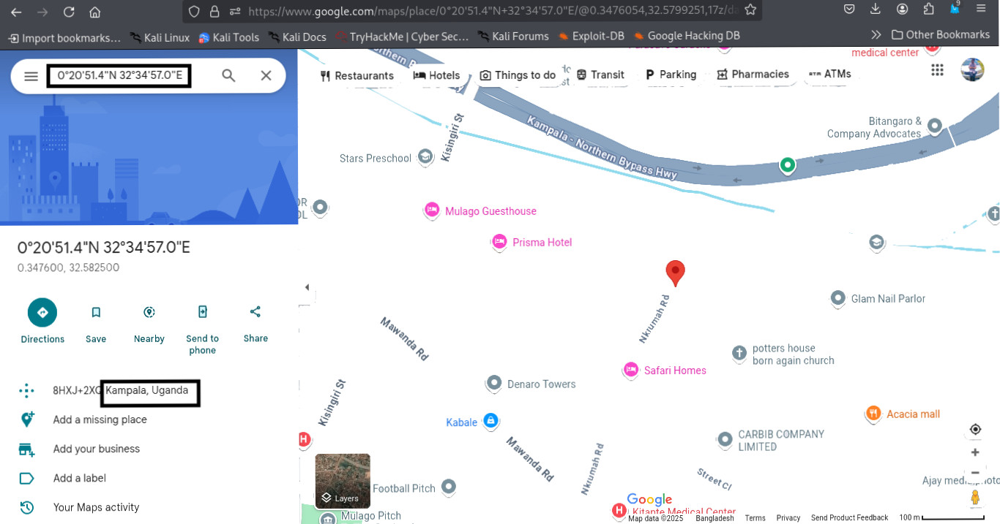

# World Tour

**Category:** Cryptography 

---

### Problem Description:

One of our favourite musician Mr.X left us a message. Do you know what does that mean?

Flag Format: CSCUU{}

---

### Solution:
I read the problem and saw there was a file named `message.txt` attached. After downloading and opening it, I found the following message inside:

CSCUU{(0.3476, 32.5825)(13.7563, 100.5018)(39.9334, 32.8597)(-34.6037, -58.3816)(44.4268, 26.1025)(-35.2809, 149.1300)(50.4501, 30.5234)(27.7172, 85.3240)(28.6139, 77.2090)(21.0278, 105.8342)(30.0444, 31.2357)(-1.9706, 30.1044)(40.4168, -3.7038)(41.9028, 12.4964)(36.8065, 10.1815)(15.3694, 44.1910)}

You can download the original message file here:  
[message.txt](../External_Folder/message.txt)

At first, it looked like a series of latitude and longitude coordinates.

---

### Approach:

I opened Google Maps and searched for each coordinate pair, for example: `0.3476, 32.5825`. 

For each one, Google Maps showed the city and country at that location.

I did this for all coordinate pairs listed in the message.

Then, I took the first letter of each country's name in order and arranged them.

This spelled out the hidden flag.

**Here is the map showing locations as example(`0.3476 32.5825)`:**

---

**The full list of coordinates along with their city and country names.**

| Latitude  | Longitude  | Location (City, Country)         |
|-----------|------------|---------------------------------|
| 0.3476    | 32.5825    | Kampala, Uganda                 |
| 13.7563   | 100.5018   | Bangkok, Thailand              |
| 39.9334   | 32.8597    | Ankara, Turkey                 |
| -34.6037  | -58.3816   | Buenos Aires, Argentina        |
| 44.4268   | 26.1025    | Bucharest, Romania             |
| -35.2809  | 149.1300   | Canberra, Australia            |
| 50.4501   | 30.5234    | Kyiv, Ukraine                  |
| 27.7172   | 85.3240    | Kathmandu, Nepal               |
| 28.6139   | 77.2090    | New Delhi, India               |
| 21.0278   | 105.8342   | Hanoi, Vietnam                 |
| 30.0444   | 31.2357    | Cairo, Egypt                   |
| -1.9706   | 30.1044    | Kigali, Rwanda                 |
| 40.4168   | -3.7038    | Madrid, Spain                  |
| 41.9028   | 12.4964    | Rome, Italy                   |
| 36.8065   | 10.1815    | Tunis, Tunisia                |
| 15.3694   | 44.1910    | Sana'a, Yemen                 |

---

### Conclusion:

This was like Mr.X’s “world tour” represented by coordinates.

By decoding all the locations and extracting the initials, I was able to find the flag and solve the challenge.

---

**Flag :**  
`CSCUU{UTTARAUNIVERSITY}`

