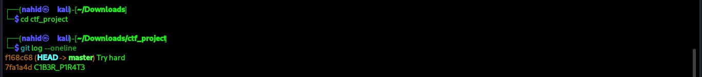
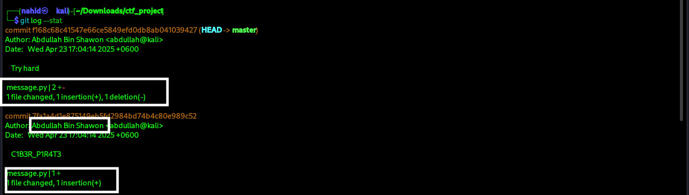
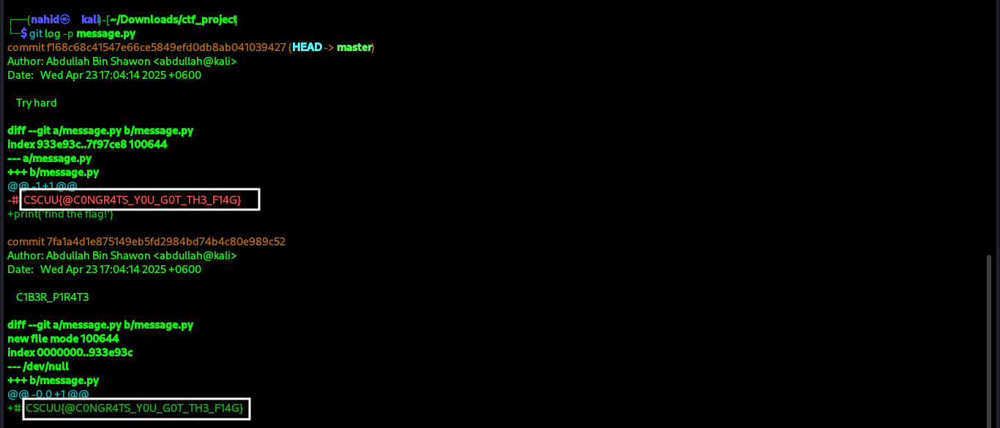

# Secret Game 
**Category:** General Skill 

---
## Problem:
The team was working perfectly—until a mysterious commit ruined everything. Who pushed the change that caused the trouble? 

**Flag Format:** CSCUU{}

You can Download the file from here:  [ctf_project.zip](../External_Folder/ctf_project.zip)

---
## Approach:

I opened the challenge description and noticed a file attached: `ctf_project.zip`. I downloaded the ZIP and immediately unzipped it, expecting to find the usual project files. After extraction I entered the new folder, but only one file — `message.py` — was visible. That felt odd: why would a real project only show one Python file?

At this point I stepped back to my terminal and ran a few Git commands to inspect the repository that was hidden inside the archive.


---

### Step 1:

**Command:**
```bash
git log --oneline
```
**What it does:** Shows commit history in a compact one-line-per-commit format with short hash and commit message.

**Result:**



My first thought: C1B3R_P1R4T3 looked like a CTF flag, so I tried submitting it. But it was rejected — not the flag.

---
### Step 2:

Command:
```
git log --stat
```
**What it does:** Shows commit history with statistics of changes per file.

**Result:**




Saw that message.py was modified in both commits. The author name appeared as Abdullah Bin Shawon.
Since the challenge asked "Who pushed the change that caused the trouble?", I thought this might be the answer — but it wasn’t. Another failed attempt.

---

### Step 3:


Command:
```
git log -p message.py
```
**What it does:** Shows commit history with exact changes for the file.

**Result:**



The output revealed that an earlier commit had the flag in a comment, but it was removed in the latest commit:

    -# CSCUU{@C0NGR4TS_Y0U_G0T_TH3_F14G}
    +print('find the flag!')

Boom — there it was! The flag had been sitting in the commit history all along.

---

**Flag:** ``CSCUU{@C0NGR4TS_Y0U_G0T_TH3_F14G}``

