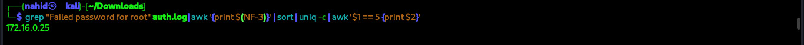

### Hide & Seek
>**Category:** Linux

**Flag Format:** ``CXXX {XXX.XXX.XXX.XXX}``

---

### Description:

R3vo1v3R has been tasked with investigating suspicious login activity on a Linux server. The system administrator suspects that someone has been trying to brute-force access to the root account. You’ve been given access to the /var/log/auth.log file to identify the source of the attack.

Objective: Find the IP address that attempted to log in as root exactly five times. This IP is your flag.

**Download File:** [log.zip](../External_Folder/log.zip)

---

### Approach:


I started by carefully reading the problem description. The challenge mentioned suspicious login attempts on a Linux server and asked to find the IP address that tried to log in as root exactly five times. A **log.zip** file was provided.

After downloading it, I opened my terminal and unzipped the archive, which gave me the auth.log file. My task was to identify the IP that attempted to access root five times — but all of these were failed attempts.


I knew I could use grep to search through the logs efficiently.``grep`` is a command-line tool for searching text patterns within files.I ran a command to find all **“Failed password for root”** entries, pulled out the IP addresses, counted their occurrences, and filtered only those that appeared exactly five times:

    grep "Failed password for root" auth.log | awk '{print $(NF-3)}' | sort | uniq -c | awk '$1 == 5 {print $2}'



Here’s what each part did:

    awk '{print $(NF-3)}' extracted the field containing the IP from each matched line.

    sort | uniq -c counted the occurrences of each IP.

    awk '$1 == 5 {print $2}' filtered only those IPs that appeared exactly 5 times.


Victory! The IP was 172.16.0.25. I smiled, thinking I had cracked it — but submitting it as a flag failed.The challenge expected a **CXXX{XXX.XXX.XXX.XXX}** format.  I tried **CLOG{172.16.0.25}** and **CVAR{172.16.0.25}**, but both failed.

It became clear that the author had intentionally made this tricky. I realized I needed to manually inspect the log to find the flag, but the file had over a thousand lines — too much to search by eye.
Then a thought hit me: the flag must have ``{`` and ``}``. That was my clue. So I decided to search for lines with ``{`` in the log:

    grep "{" auth.log


And boom — there it was! I finally found the hidden flag. My little trick worked, and at last, I was successful.

---

### **Flag:** ```CSC{Nginx_Running_Behind}```
