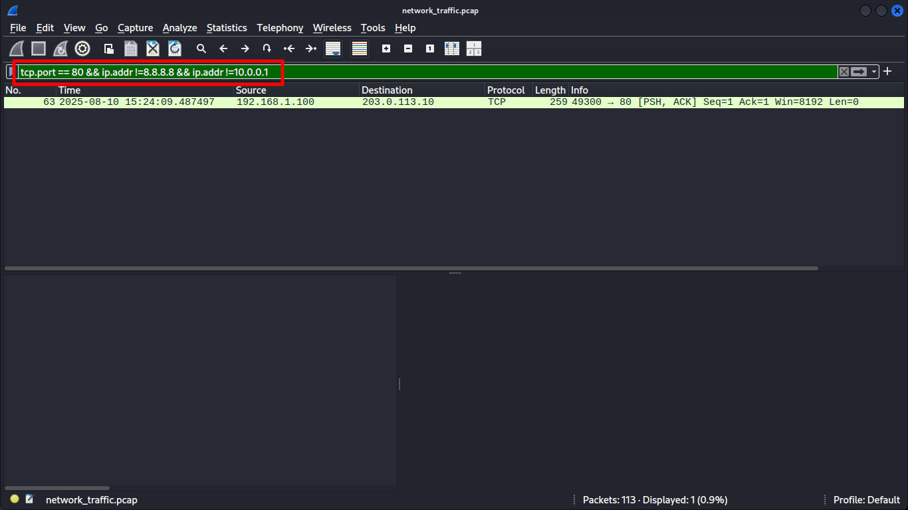
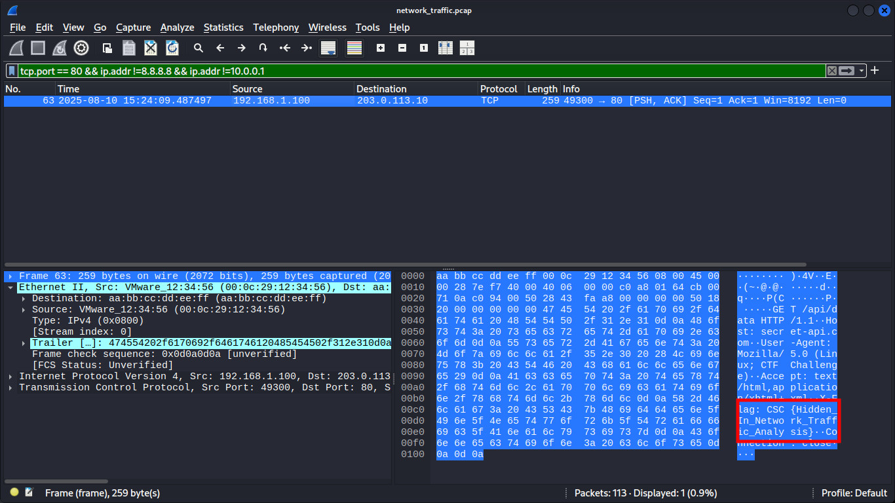
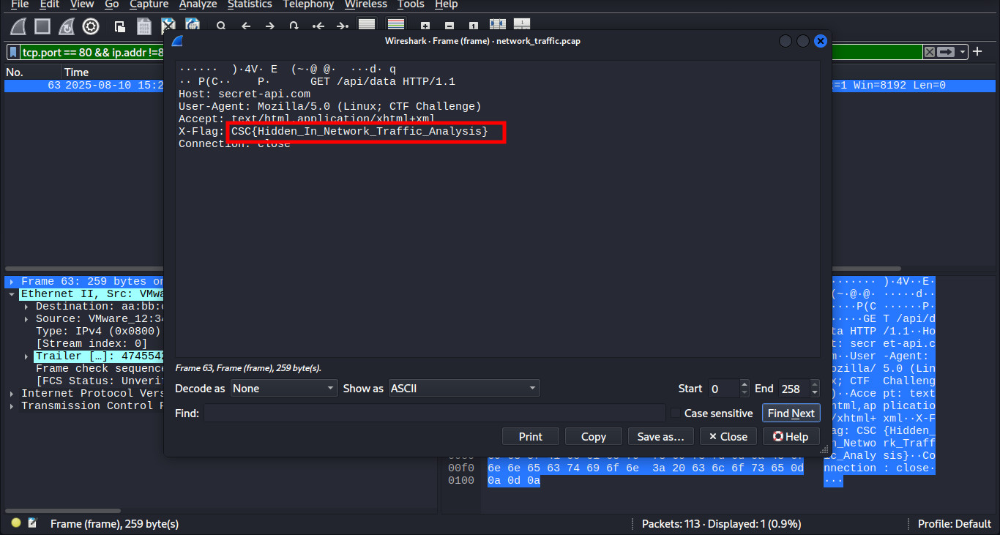

### Port 80
>**Category:** Network

**Flag:** ``CSC{XXXX_XXXX_XXXX}``

---

### Description:

You've gained shell access to a compromised Linux system suspected of hosting a hidden service on a known port. Intelligence suggests this service contains sensitive information—possibly a flag—but it's been deliberately obfuscated to evade detection.

The system is noisy: multiple services are running, some are decoys, others are filtered, and the real one is protected by subtle mechanisms. Your mission is to identify, verify, and connect to the correct service to retrieve the flag.

**Download File:** [netwrok_traffic.pcap](../External_Folder/network_traffic.pcap)

---

### Approach:

I started by carefully reading the challenge description. The mission was to investigate a compromised Linux system suspected of hosting a hidden service. The goal was to identify the correct service and retrieve a flag.

A **network_traffic.pcap** file was provided, which I downloaded and opened in **Wireshark**.

**Wireshark** is a powerful network protocol analyzer used to inspect packet-level traffic. It allows filtering by protocol, port, or IP, making it ideal for identifying suspicious or hidden communications within captured network data.


The question’s title, **"Port 80"**, felt like a hint, so I applied a filter in Wireshark for **``tcp.port == 80``**. This revealed a large number of packets. At first glance, these seemed too organized to contain the flag directly, so I suspected there might be an outlier IP hidden among them.


I decided to filter out common, non-suspicious IP addresses — specifically **8.8.8.8 (Google DNS)** and **10.0.0.1 (internal gateway)**. 
I use this line on filter on box ``tcp.port == 80 && ip.addr !=8.8.8.8 && ip.addr !=10.0.0.1`` Where ,that means display all TCP port 80 (HTTP) traffic except packets to or from IPs 8.8.8.8 and 10.0.0.1.

After excluding these, I was left with only a single packet.




Taking a closer look at this remaining packet ,I discovered the hidden flag embedded within the data.



Then by clicking on the Frame option, the flag can be viewed neatly, and with that, this simple networking challenge is completed.



---

### **Flag:** ```CSC{Hidden_In_Network_Traffic_Analysis}```
