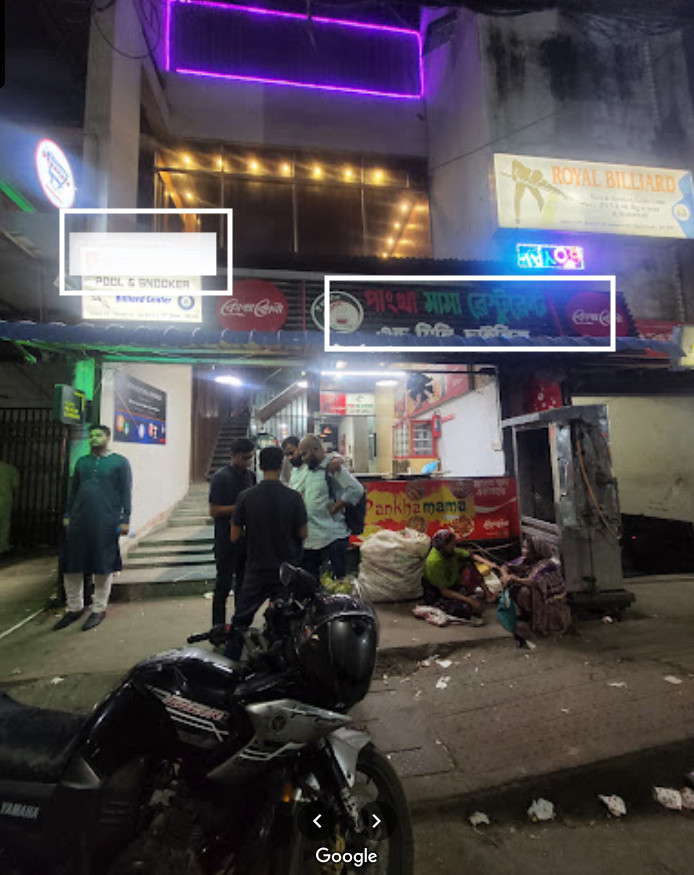
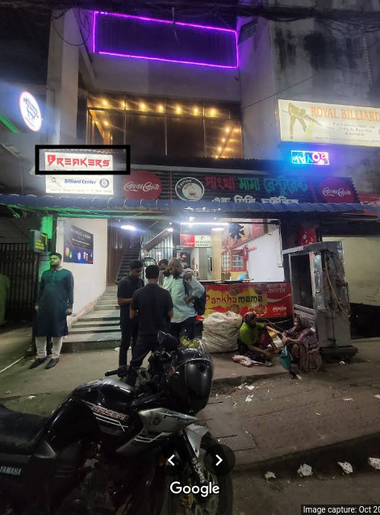

# Uncover the Spot
**Category:** OSINT  

---

## Challenge Description
This is a picture of one of the most popular places in Uttara. Your task is to find the name hidden in the white blurred portion of the image.  
> Flag Format: `CSCUU{PlaceName}`

*Do you know how to use Google Maps? (Cost: 0 points)*

An image file `OSINT_challange.png` was provided with the challenge.

Download : [OSNIT_challange.png](../Image_Folder/OSINT_challange.png)

---

## Approach:

### Step 1 — Initial Observation
I opened the given image and noticed A white blurred portion hiding some text.
The visible part of the image showed the name of a restaurant: **Pankha Mama Restaurant & Mini Chinese**.

The hint clearly pointed towards using **Google Maps** for OSINT.

---

### Step 2 — Using Google Maps And Finding the Original Photo
Since we already had the restaurant name, I searched **"Pankha Mama Restaurant & Mini Chinese"** in Google Maps.
On the restaurant’s Google Maps page,I went to the **Photos** section.Then Started scrolling through the uploaded images.

---

### Step 3 — Spotting the Match
Boom! Found the **exact same image** without the blur.  

In the unblurred version, the hidden portion revealed the word **BREAKERS**.

---

### Flag:``CSCUU{BREAKERS}``
