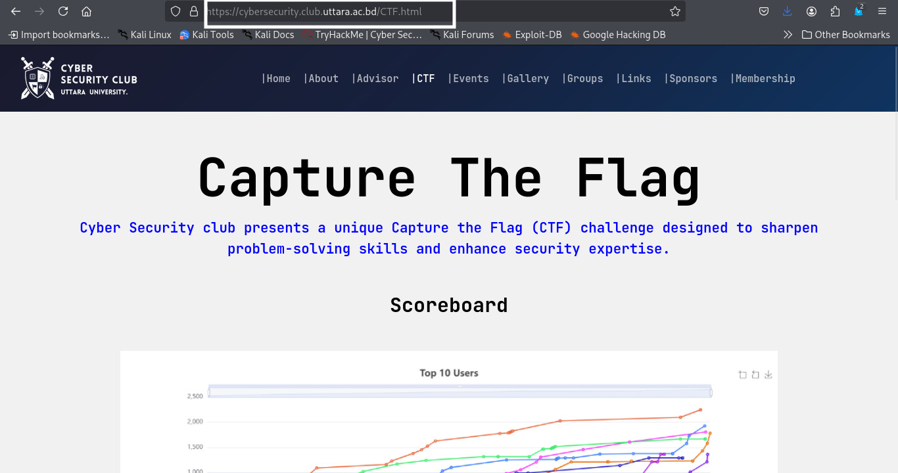
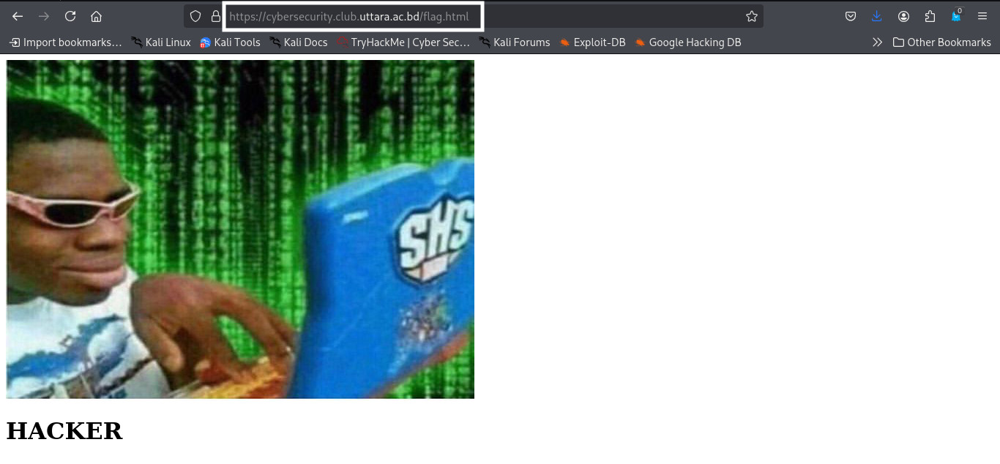
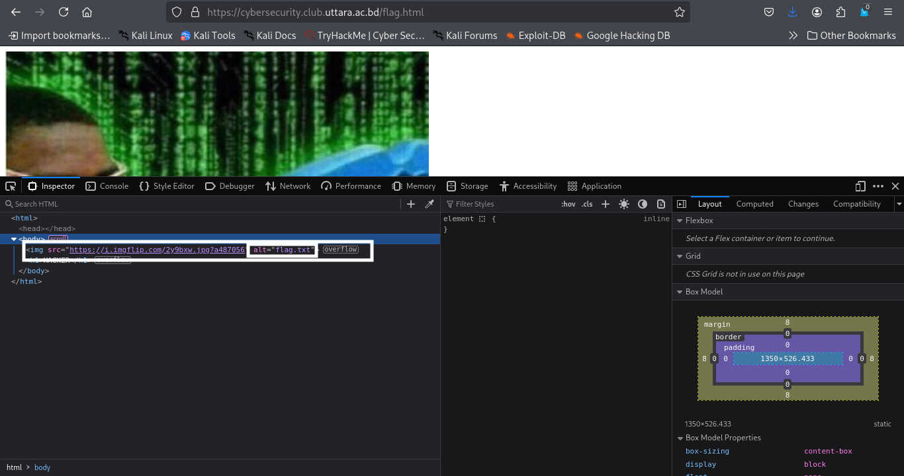
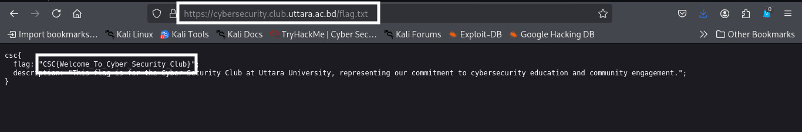

### Developer's Mistake
>**Category:** Web

**Flag format:** ``CSC{XXXX_XXXX_XXX}``

---

### Description:

Welcome to the **Cyber Security Club** at **Uttara University!** . A new feature was supposed to greet users with a friendly message when they visited the site… but it mysteriously vanished form the resource locator.

One of our developer, Pritom, may have made a mistake while implementing it. Your mission is to inspect the site, uncover why the greeting message isn't appearing for new visitors, and report it as a bug.

[https://cybersecurity.club.uttara.ac.bd](https://cybersecurity.club.uttara.ac.bd)

---

### Approach:

I started by carefully reading the challenge description. The task was to investigate why a greeting message was not appearing for new visitors on the Cyber Security Club website and to report it as a bug. A hint in the description mentioned the **resource locator**.
A **resource locator** refers to the part of a website **URL** that points to a specific page or resource on the server, such as **/home.html** or **/ctf.html**.

I opened the website: [https://cybersecurity.club.uttara.ac.bd](https://cybersecurity.club.uttara.ac.bd) and began inspecting the page source in the browser. I initially checked for any hints or comments in the **HTML** or **JavaScript** but found nothing.

Remembering the description’s hint about the resource locator, I navigated to the home page and observed the URL:

    https://cybersecurity.club.uttara.ac.bd/index.html

  


I then explored the CTF section by clicking the relevant option, which led to:

    https://cybersecurity.club.uttara.ac.bd/CTF.html


 
 

Here, I suspected the flag might be hidden. I attempted to access various pages by changing the URL parameter: **welcome.html**, **guest.html** — but these returned nothing useful.

Finally, I tried **flag.html** in the URL. This page loaded, displaying a funny image and the text **"HACKER"**. 

    https://cybersecurity.club.uttara.ac.bd/flag.html

 


Inspecting the page source, I noticed that the image had an alt attribute pointing to ``flag.txt``.


 
 

Following this clue, I replaced the parameter in the URL with flag.txt and accessed the page. To my satisfaction, the flag was revealed.

    https://cybersecurity.club.uttara.ac.bd/flag.txt

 

 ---

 ### **Flag:** ```CSC{Welcome_To_Cyber_Security_Club}```
